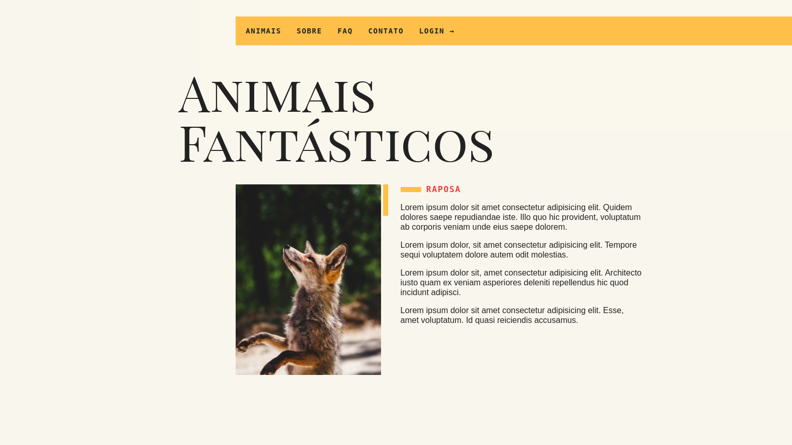

<h1 align="center">Javascript Study</h1>

<a href="https://rafaelofil.github.io/animais-fantasticos/">
  
</a>

## Table of contents
* [General info](#general-info)
* [Technologies](#technologies)
* [Setup](#setup)
* [Final Considerations](#final-considerations)

## General Info
<p>Web page made with JavaScript. This project was developer to study javascript animation as smooth scroll, accordion, tabnav, modal, tooltip, animation scroll, dropdown menu and menu mobile.</p>

## Technologies
Project is created with:

* HTML5
* JavaScript
* CSS3
* Webpack

## Setup
To run this project in local is necessary:

```
$ npm clone https://github.com/rafaelofil/animais-fantasticos.git
```
Or download the repository, after that just open.

You can acess the link and check the slide : https://rafaelofil.github.io/animais-fantasticos/

## Final considerations

<p>Made in the Origamid JavaScript ES6 course.</p>
<p>Any doubt, feel free to get in touch.</p>

<hr>
<p align="center"> I hope you enjoy 😎</p>
